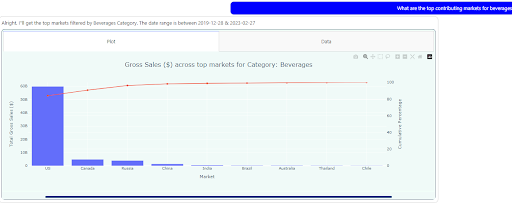

# **Congnitive Insights Platform Using Large Language Models**

## **Cognitive Insights Platform (CIP)**
- This a platform developed to facilitate data visualization for business crowd. 
- The prelimary feature of this tool is to create visualizations by querying a tabular data based on Natural Language inputs generated by the users.

- For a user query : `What are the top contributing markets for beverages`
The output is as shown below.

  

## **Capabilities**
- Generate Graphs
    1. Bar Graphs : What are the top 5 markets for snacks?
    2. Line Charts : Trend of sales over the last 5 years
    3. Pareto Charts : Top contributing markets across production waste.
    4. Multiple Line Graphs : Compare the trend of sales across categories
- Create commentary on line graphs in terms of the key drivers impacting the change in the target variable.
- Toggle between Plot or Tabular view.

## **Components**
- The CIP currently needs **intent** and **entity detection** framworks.
- Based on the intents and the entities, the data is filtered/transformed and an appropriate graph is generated.

## **Dependencies**
- For the key task of intent and entity detection, **Google Dialogflow** has been utilized. 
- Google Dialogflow is an NLP framework that allows for quick and easy training for intent and entity detection model using a seamless UI.

## **Goals**

- The main goal of this initiative is to build and in-house pipeline for the tasks mentioned in order to replace the Dialogflow Api.
- This will prevent the exposure of queries generated by clients to third party tools.

## **Proposed Framework**

- The proposed framework will have 4 key components:
    1. **Intent Detection**
    2. **Entity Detection**
    3. **Keywords Search**
    4. **Date Extraction**

1. **Intent Detection** : The intent detection pipeline consists of GPT-2 model trained to classify sentence into one of seven defined intents. 
    1. **Aggregation** - Primarily generates bar charts or tabular view to for queries.
    2. **compare_trend** - Primary compares the trend of multiple entities across various dimensions through line charts.
    3. **dervied_metrics** - Creates charts show case percentage share of various entities across dimensions. Moslty generates Pie Charts.
    4. **no_comp_trend** - Creates a simple line graphs, and in case multiple entities are queried, each entity is displayed in a separate figure.
    5. **no_trend_compare** - Compares multiple entities across various dimensions with capability to generate line or bar plots.
    6. **simple_graphs** - Creates a single line line for any entity.
     
     

2. **Entity Detection** : The entity detection pipeline is based on a token classifier created using **BERT** model. The follwing entities are captured.
    1. **display_col**
    2. **filter_col**
    3. **date_period**
    4. **agg_col**
    5. **derivedmetrics_col**

3. **Keyword Search** : Additionally the following entities are captured using a keyword search algorithm based on *Huffman Encoding*. An NER/Token Classification model is not recommended for these as they are contain utterances specific the each enitity.
    1. **function** 
    2. **mathematical_filter**
    3. **forecast**
    4. **nrows**
    5. **number**

4. **Date Extraction** : For the this use case reference to date periods are most likely to occur in natural language, for instance `last 2 years`, `this year vs last year`. A python library **Duckling** is used to convert such utterances in python datetime objects that can be used downstream for data filtering.

## **Performance Comparison**

- **Intent Detection**

<table class="tg">
<thead>
  <tr>
    <th class="tg-lboi"><b>Intent</b></th>
    <th class="tg-lboi" colspan="3"><b>DialogFlow</b></th>
    <th class="tg-lboi" colspan="3"><b>GPT-2</b></th>
  </tr>
</thead>
<tbody>
  <tr>
    <td class="tg-lboi"></td>
    <td class="tg-lboi"><b>Precision</b></td>
    <td class="tg-lboi"><b>Recall</b></td>
    <td class="tg-lboi"><b>F1 Score</b></td>
    <td class="tg-lboi"><b>Precision</b></td>
    <td class="tg-lboi"><b>Recall</b></td>
    <td class="tg-lboi"><b>F1 Score</b></td>
  </tr>
  <tr>
    <td class="tg-lboi"><b>aggregation</b></td>
    <td class="tg-lboi">0.94</td>
    <td class="tg-lboi">1.0</td>
    <td class="tg-lboi">0.91</td>
    <td class="tg-lboi">1.0</td>
    <td class="tg-lboi">1.0</td>
    <td class="tg-lboi">1.0</td>
  </tr>
  <tr>
    <td class="tg-lboi"></b>compare_trend</b></td>
    <td class="tg-lboi">1.0</td>
    <td class="tg-lboi">1.0</td>
    <td class="tg-lboi">1.0</td>
    <td class="tg-lboi">1.0</td>
    <td class="tg-lboi">1.0</td>
    <td class="tg-lboi">1.0</td>
  </tr>
  <tr>
    <td class="tg-lboi"><b>derived_metrics</b></td>
    <td class="tg-lboi">1.0</td>
    <td class="tg-lboi">0.79</td>
    <td class="tg-lboi">0.88</td>
    <td class="tg-lboi">1.0</td>
    <td class="tg-lboi">1.0</td>
    <td class="tg-lboi">1.0</td>
  </tr>
  <tr>
    <td class="tg-lboi"><b>no_comp_trend</b></td>
    <td class="tg-lboi">1.0</td>
    <td class="tg-lboi">1.0</td>
    <td class="tg-lboi">1.0</td>
    <td class="tg-lboi">0.92</td>
    <td class="tg-lboi">0.96</td>
    <td class="tg-lboi">0.94</td>
  </tr>
  <tr>
    <td class="tg-lboi"><b>no_trend_compare</b></td>
    <td class="tg-lboi">1.0</td>
    <td class="tg-lboi">1.0</td>
    <td class="tg-lboi">1.0</td>
    <td class="tg-lboi">0.88</td>
    <td class="tg-lboi">1.0</td>
    <td class="tg-lboi">0.93</td>
  </tr>
  <tr>
    <td class="tg-lboi"><b>simple_graphs</b></td>
    <td class="tg-lboi">1.0</td>
    <td class="tg-lboi">1.0</td>
    <td class="tg-lboi">1.0</td>
    <td class="tg-lboi">1.0</td>
    <td class="tg-lboi">0.50</td>
    <td class="tg-lboi">0.67</td>
  </tr>
  <tr>
    <td class="tg-lboi"><b>Accuracy</b></td>
    <td class="tg-lboi"></td>
    <td class="tg-lboi"></td>
    <td class="tg-lboi">0.98</td>
    <td class="tg-lboi"></td>
    <td class="tg-lboi"></td>
    <td class="tg-lboi">0.97</td>
  </tr>
  <tr>
    <td class="tg-lboi"><b>macro average</b></td>
    <td class="tg-lboi">0.99</td>
    <td class="tg-lboi">0.97</td>
    <td class="tg-lboi">0.98</td>
    <td class="tg-lboi">0.97</td>
    <td class="tg-lboi">0.91</td>
    <td class="tg-lboi">0.93</td>
  </tr>
  <tr>
    <td class="tg-lboi"><b>micro average</b></td>
    <td class="tg-lboi">0.98</td>
    <td class="tg-lboi">0.98</td>
    <td class="tg-lboi">0.98</td>
    <td class="tg-lboi">0.98</td>
    <td class="tg-lboi">0.97</td>
    <td class="tg-lboi">0.97</td>
  </tr>
</tbody>
</table>

